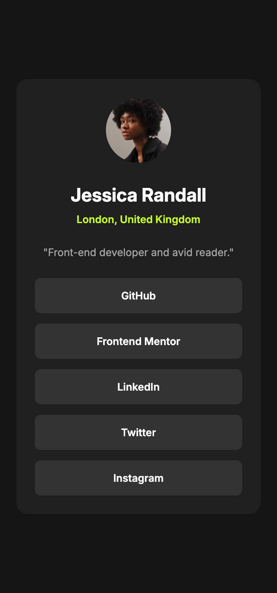

# Frontend Mentor - Social links profile solution

This is a solution to the [Social links profile challenge on Frontend Mentor](https://www.frontendmentor.io/challenges/social-links-profile-UG32l9m6dQ). Frontend Mentor challenges help you improve your coding skills by building realistic projects. 

## Table of contents

- [Overview](#overview)
  - [The challenge](#the-challenge)
  - [Screenshot](#screenshot)
  - [Links](#links)
- [My process](#my-process)
  - [Built with](#built-with)
  - [What I learned](#what-i-learned)
  - [Continued development](#continued-development)
  - [Useful resources](#useful-resources)

## Overview

### The challenge

use of grid and flex use of BEM use of semantic html and css

### Screenshot

### Links

- Solution URL: [Solution](https://github.com/fsanz/social-links-profile-main)
- Live Site URL: [live site URL](https://fsanz.github.io/social-links-profile-main)

## My process

### Built with

- Semantic HTML5 markup
- CSS custom properties
- Flexbox
- CSS Grid
- Mobile-first workflow

### What I learned

I deepened my knowledge about css grid and flexbox

### Continued development

 to have a stylesheet to automate the css rules reset

### Useful resources

- [A Complete CSS Grid Layout Guide](https://css-tricks.com/complete-guide-css-grid-layout/)
- [A Complete CSS Flexbox Layout Guide](https://css-tricks.com/snippets/css/a-guide-to-flexbox/)

